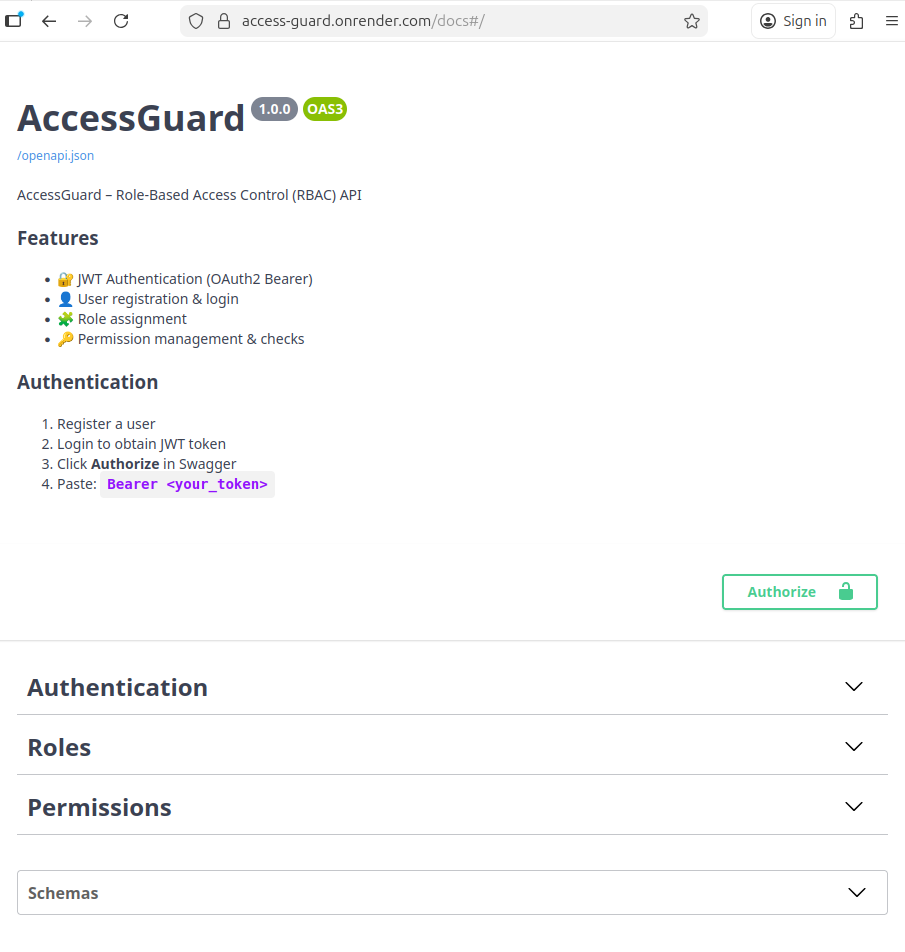

# AccessGuard – Role-Based Access Control API

**Live demo:** [https://access-guard.onrender.com/docs](https://access-guard.onrender.com/docs)

---

## Opis projektu

AccessGuard to system RBAC (Role-Based Access Control) napisany w Pythonie z FastAPI.  
Pozwala na:
- Rejestrację i logowanie użytkowników z JWT
- Tworzenie ról i przypisywanie uprawnień
- Sprawdzanie dostępu użytkowników do zasobów
- Deployment w Dockerze (lokalnie i w chmurze)

Projekt jest **produkcyjnie przygotowany**, a jego demo działa w Render.com.

---

## Funkcjonalności

1. **Rejestracja użytkowników** (`/auth/register`)  
2. **Logowanie** (`/auth/login`) → JWT  
3. **Role i uprawnienia**:
   - Tworzenie ról i uprawnień
   - Przypisywanie ról użytkownikom
   - Sprawdzanie dostępu użytkowników (`/permissions/check`)
4. **Swagger UI i Redoc**:
   - `/docs` → Swagger (interaktywne testowanie)
   - `/redoc` → alternatywna dokumentacja

---

## Technologie

- **Python 3.11**  
- **FastAPI** – framework API  
- **SQLAlchemy** – ORM  
- **SQLite** (demo) / przygotowane pod Postgresa  
- **Docker + docker-compose**  
- **Render.com** – hosting darmowy, live demo  
- **Pytest + pytest-asyncio** – testy integracyjne  

---

## Demo online

- Swagger UI: [https://access-guard.onrender.com/docs](https://access-guard.onrender.com/docs)  
- Redoc: [https://access-guard.onrender.com/redoc](https://access-guard.onrender.com/redoc)  

> Testowe użytkownicy można stworzyć i zalogować się, aby sprawdzić role i permissions.

---

## Uruchomienie lokalne

1. Skopiuj repozytorium:

```bash
git clone <repo-url>
cd access-guard
````

2. Uruchom w Dockerze:

```bash
docker compose up --build
```

3. Otwórz Swagger:

```
http://localhost:8000/docs
```

---

## Konfiguracja środowiska (Render / lokalnie)

* **SECRET_KEY** – losowy, długi string (JWT)
* **PORT** – `8000` (Render wymaga)
* **PYTHONUNBUFFERED** – `1` (opcjonalnie dla logów)

> Na Render.com SQLite zapisuje się w `/tmp/accessguard.db`
> Produkcyjnie można podmienić na Postgres lub inny DBMS przez `DATABASE_URL`.

---

## Testy

Projekt zawiera testy integracyjne w `tests/test_auth.py`.
Uruchom:

```bash
pytest
```

---

## Struktura projektu

```
access-guard/
├── app/
│   ├── core/          # openapi, security, tags
│   ├── services/      # auth_service, permission_service
│   ├── main.py        # FastAPI app + endpoints
│   ├── models.py      # SQLAlchemy models
│   ├── schemas.py     # Pydantic schemas
│   └── database.py    # DB setup
├── tests/             # testy integracyjne
├── Dockerfile
├── docker-compose.yml
├── requirements.txt
└── README.md
```

---

## Lekcje i nauka

* Deployment w chmurze bez karty kredytowej (Render.com)
* Docker i docker-compose w praktyce
* JWT i RBAC w aplikacjach webowych
* Projektowanie API + Swagger UI
* Testy integracyjne + automatyzacja

---

## Screenshots

### Swagger UI


---
